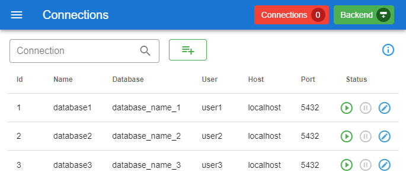
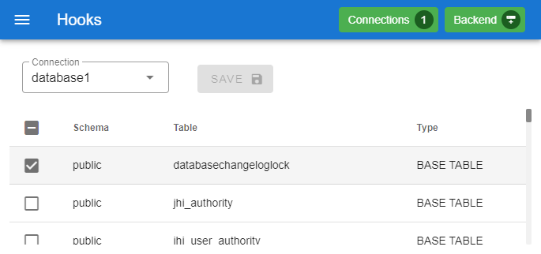
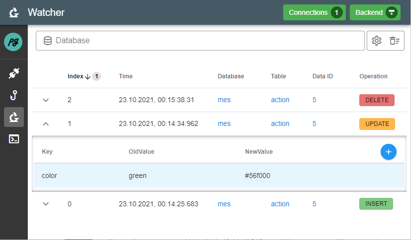
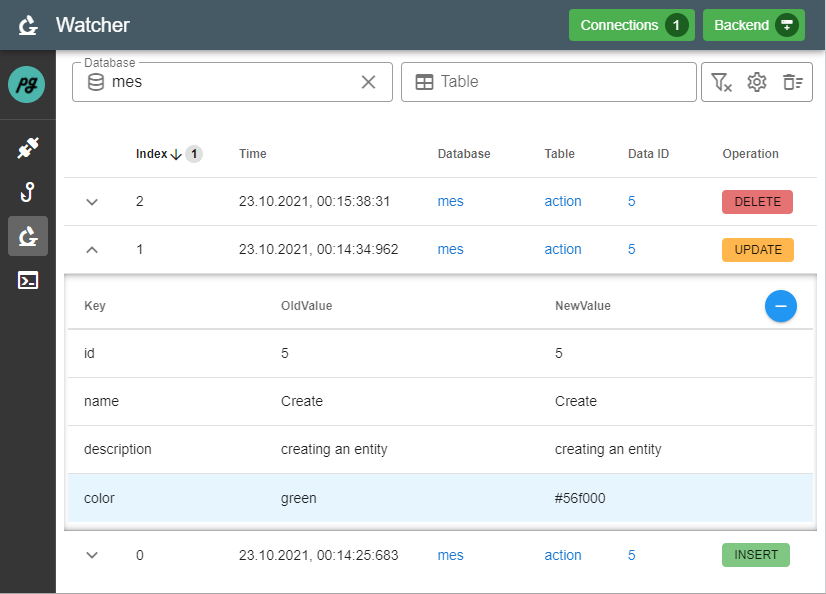

# pgtools

Application for debugging applications that use postgres as DBMS.
The application aims to help the user to understand their application by displaying the database events triggered by the application in real time.

## General

Application built with NodeJS/Typescript (server-side) and vue.js (client-side).
The sub-projects for front- and backend can be found in the respective folders.

## Deployment

The application is intended to run on the local machine for debugging purposes.

The application can be started with the ```docker-compose up -d``` command.

## Development

### Backend
The development server can be started via
```
cd server
npm install
npm run start:dev
```
This spins up the application in development mode. Nodemon is used to hot-reload changes.

Frontend
```
cd client
npm install
npm run serve
```
This spins up the VueJS development server.


## Note
The application uses postgres trigger and trigger functions to intercept the database events and to forward them via pg_notify. For this reason, before using the application, you should check whether the used names of the trigger or trigger functions interfer with existing ones. 
Names used
* triggers: **notify_trigger**
* trigger functions: **notify_event**

**IMPORTANT:** This application should only be used for debugging purposes with development databases


## Worklow

Create Connection > Activate Connection > Avtivate Table Watch > Watch Tables

Connections: Create new and manage existing database connections



Hooks: Define which database tables should be watched by the application



Watcher: View events in realtime, filter events by database, table and id

Expand table row to see which column has changed. By default only the columns with the change is shown. The detail view can be expanded via the blue plus icon to show the whole row/object (only available for UPDATE operations). Columns with changes are highlighted in blue. The default behavior can be changed in the settings so that the entire object is automatically displayed when opened.



Watcher view with whole object expanded.



