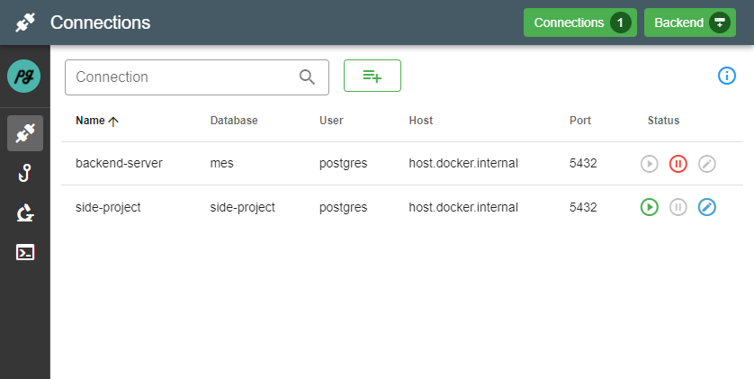
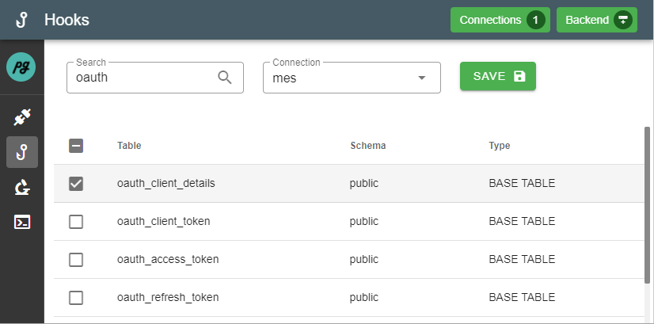

# pgtools

Application for debugging applications that use postgres as DBMS.
The application aims to help the user to understand their application by displaying the database events triggered by the application in real time.

## Deployment
The application is intended to run on the local machine for debugging purposes.

The application can be started with the ```docker-compose up -d``` command.

## Development

### General
Application built with python3 (server-side) and vue.js (client-side).
The sub-projects for front- and backend can be found in the respective folders.

### Note
The application uses postgres trigger and trigger functions to intercept the database events and to forward them via pg_notify. For this reason, before using the application, you should check whether the used names of the trigger or trigger functions interfer with existing ones. 
Names used
* triggers: **notify_trigger**
* trigger functions: **notify_event**

**IMPORTANT:** This application should only be used for debugging purposes with development databases


### Worklow

Create Connection > Activate Connection > Avtivate Table Watch > Watch Tables

Connections: Create new and manage existing database connections


Hooks: Define which database tables should be watched by the application


Watcher: View events in realtime, filter events by database, table and id


Watcher: Check in the detail event view which data have been changed


